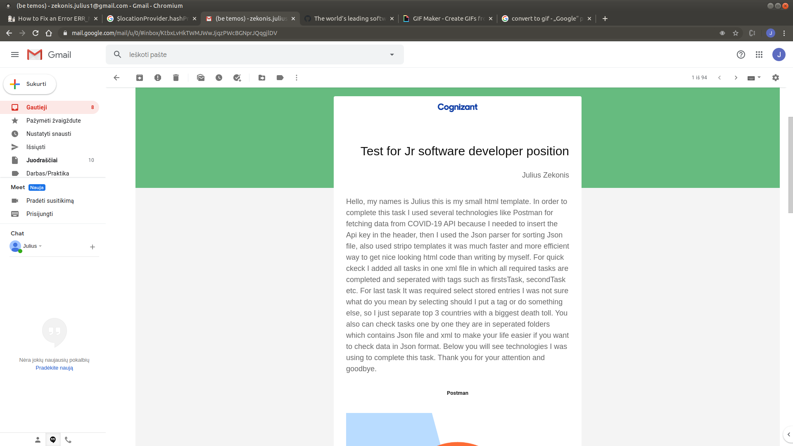
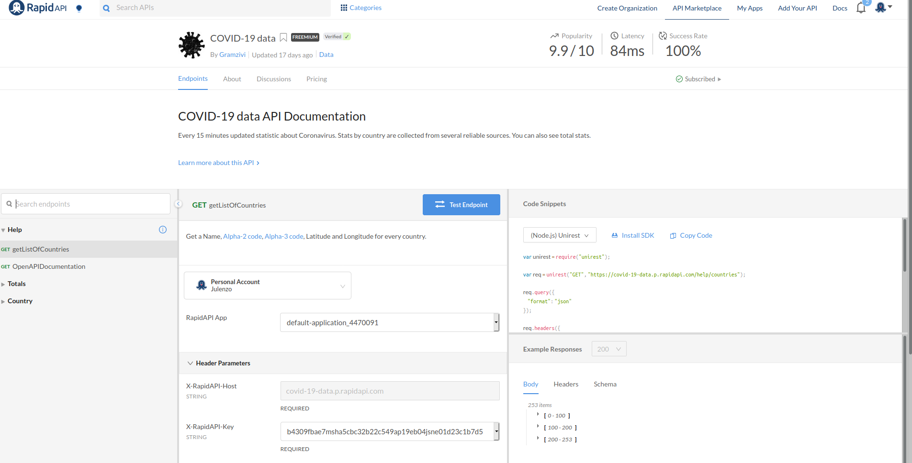
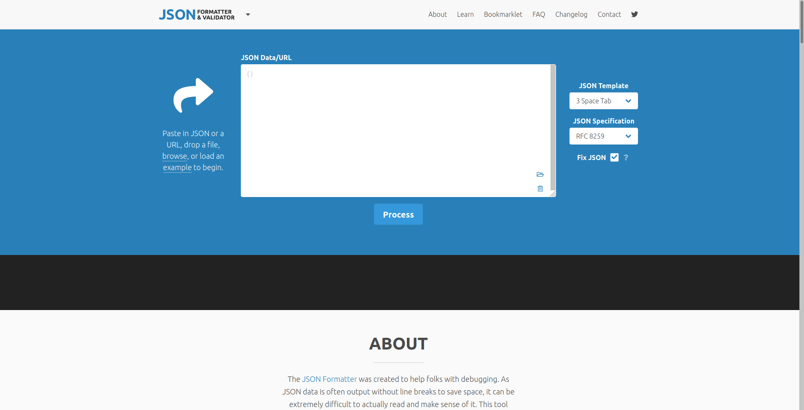
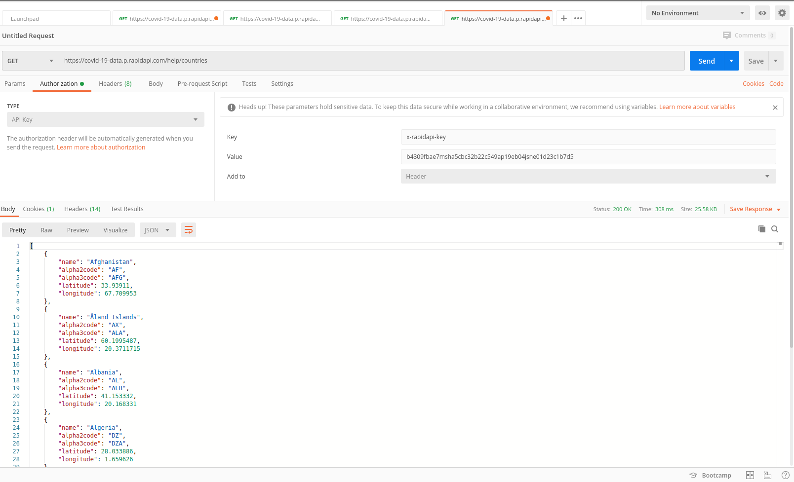

<h1> GitHub only allows certain HTML elements and attributes inside their markdown so I'cant  display html template but I can use some pictures
 to show how template looks and what technology I use for this task </h1>

<h1> Html template  </h1>

<h1>Fetch data from Rapid Api </h1>

<h1> Fix files with Json parser </h1>

<h1> Postman for http requests </h1>

